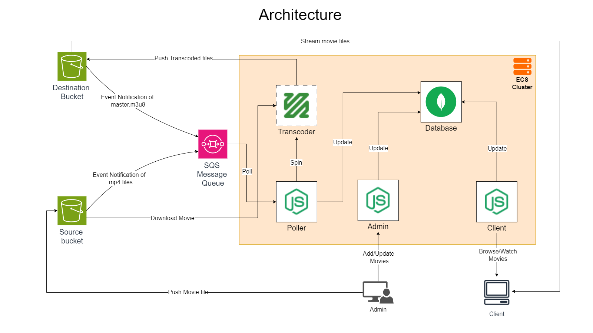

# Moviemate - Video Transcoding Automation

Moviemate is an automated video transcoding platform that uses FFmpeg for video processing and AWS services for storage, queuing, and orchestration. It allows for seamless transcoding of video files uploaded to an S3 bucket, then uploads the processed videos back to a destination bucket. S3 event notifications trigger tasks in an SQS queue, processed by a poller. The platform provides both an admin panel for managing movies and a client panel for viewing them.

## Features
- **Video Transcoding**: Automated video transcoding using FFmpeg to convert videos into different formats and resolutions.
- **Admin Panel**: Allows admins to manage movies, monitor transcoding tasks, and configure settings.
- **Client Panel**: Allows users to view movies after they have been transcoded and uploaded.
- **Cloud Infrastructure**: Utilizes AWS S3 for storage, SQS for task queuing, and ECS for container orchestration.
- **Terraform Automation**: All infrastructure setup and configuration is automated via Terraform scripts.

## Technologies Used
- **Frontend**: Angular
- **Backend**: Node.js, Express.js
- **Database**: MongoDB
- **Video Transcoding**: FFmpeg, Python, Node.js
- **AWS Services**: ECS, S3, SQS, CloudMap, ECR
- **Infrastructure as Code**: Terraform

## Architecture Overview

1. **S3 Buckets**: There are two S3 buckets:
   - **Source Bucket**: Videos are uploaded here by users.
   - **Destination Bucket**: Transcoded videos are stored here.
   
2. **S3 Event Notifications**: Configured to trigger notifications whenever a file is uploaded to the source bucket. These notifications trigger an SQS queue.

3. **Poller**: The poller listens to the SQS queue and processes tasks (video transcoding) using FFmpeg and the AWS SDK.

4. **ECS**: The system is containerized using Docker and deployed on AWS ECS. ECS manages the containers responsible for handling video transcoding and other backend operations.

5. **Terraform**: The entire infrastructure (S3, ECS, SQS, CloudMap, etc.) is provisioned and managed using Terraform scripts.

6. **CloudMap**: Configured for service discovery and communication between ECS services.

## Getting Started

### Prerequisites
Before you begin, ensure you have the following:
- An AWS account.
- Docker installed on your machine.
- Aws-cli installed.
- Terraform installed.

### Step 1: Clone the Repository
```bash
git clone https://github.com/saikiranpaila/moviemate.git
cd moviemate
```
### Step 2: Run deploy.sh script
```bash
sudo su root
chmod 777 deploy.sh
./deploy.sh
```
- Copy the load balancer urls from the output and hit them, one lands you to admin page and other lands to client page.

- Login to the admin panel using default credentials username: ```admin``` and password: ``admin`` 

- Add and upload movies and trailer

- Watch your movies after the transcoding process is completed in the client page

## Cleaning up the resources
```bash
chmod 777 destroy.sh
./destroy.sh
```
